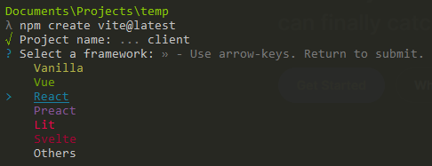
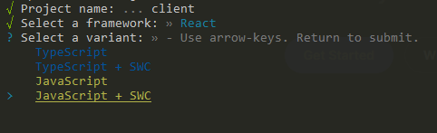

# Testing Vite
Hey learners! Due to the issues we had last Friday, I'm going to be testing out [Vite](https://vitejs.dev/) as a potential replacement for `create-react-app`. Note that at this point, there will be no change with regards to the existing assignments for the remainder of the term. However, as I will be retooling the curriculum to account for the switch, React lecture code moving forward will use Vite. I've added this README for those who rely on running the lecture code to get a feel for how things work.

## Differences
This was quite literally the first time I used vite to create a React app, so I'm not yet certain as to the extent of the differences. The key differences thus far include the following:
- Creating the app
- Running the app
- The default port the app runs on
- JSX files
- Speed

### Creating with Vite
- To create a new project, run `npm create vite@latest`.
- Unlike `create-react-app`, you'll have to select some options.
  - `Project name: >> vite-project` - this pre-populates `vite-project`. I'd still recommend using `client` as the name of the project.
  - As seen in the following image, you'll need to select `React`  
      
  - Select `JavaScript + SWC`. If that doesn't work, just select `JavaScript`. I've not had time to look into the differences here quite yet  
      

### Running a Vite-created app
Not too much of a difference here. You'll still need to run `npm install` within the directory, but instead of `npm start`, you'll run `npm run dev` as the command instead.

### Default Port
This project, by default, runs on port `5173` apparently. Vite also doesn't open a browser to the page.

### JSX vs JS
The first major difference is in Vite's use of `.jsx` files over `.js`. Technically, this is more accurate as we've been writing JSX this whole time. The only real difference you should find is the file extensions themselves.

### Speed
The best part about Vite? No more waiting for the app to be created or for the app to start